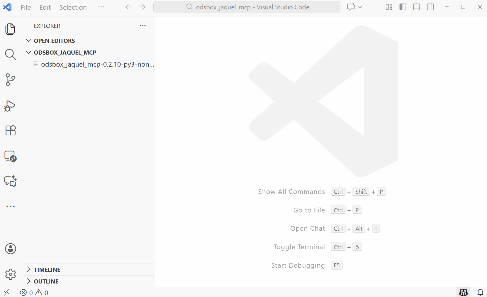

# Setup odsbox_jaquel_mcp MCP Server

## Step by Step

* Create virtual environment at `????\.venv`
  ```
  cd /D ????
  python -m venv .venv
  ```
* Activate virtual environment
  ```
  ????\.venv\Scripts\activate
  ```
* Install mcp server and dependencies to local `.venv`
  ```
  pip install odsbox_jaquel_mcp
  ```
* Call `Add MCP Server` in VSCode with
  * type: `stdio`
  * path: `????\.venv\Scripts\odsbox-jaquel-mcp.exe`

## VSCode

`.vscode\mcp.json`

```
{
	"servers": {
		"my-mcp-server-313ed3d1": {
			"type": "stdio",
			"command": "C:\\temp\\odsbox_jaquel_mcp\\.venv\\Scripts\\odsbox-jaquel-mcp.exe",
			"args": []
		}
	},
	"inputs": []
}
```

## Installation

What installation:


